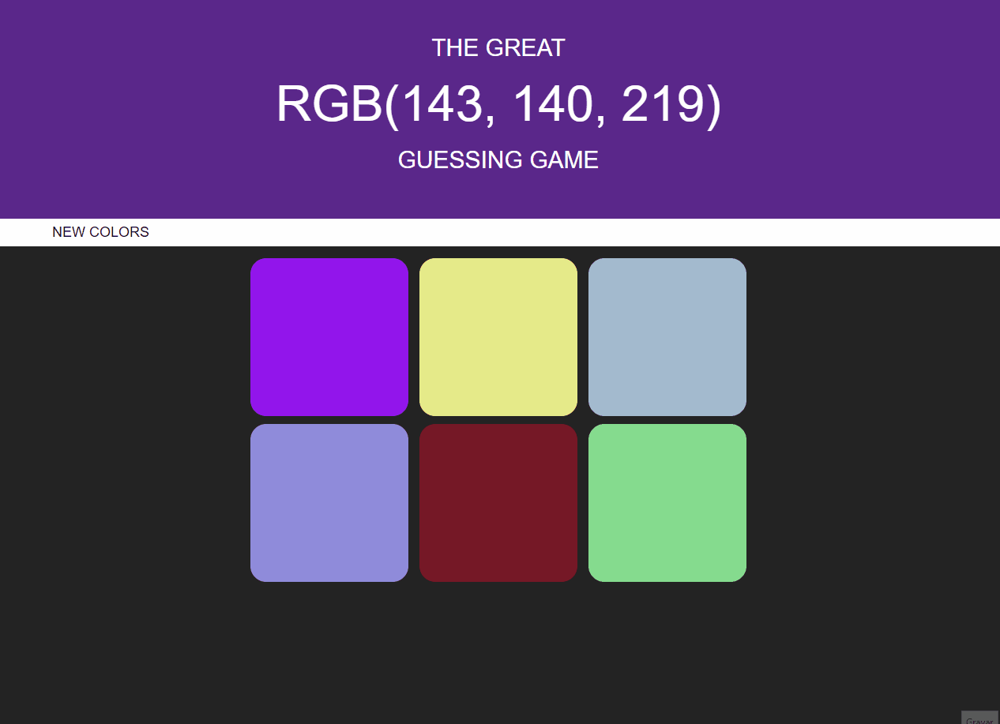

# Color Game

## How it works
A simple web app with HTML, CSS and JS. The core ideia is to guess the color based on a given RGB value.

## How to test it

You can either download the code or run it with Gitpod, a free online dev environment for Github.

